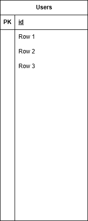

## アプリケーション名

〇〇幼稚園連絡アプリ

> [!IMPORTANT]
> クライアントと協議の結果、下記の仕様となっております
>
> 1. 一覧表示画面について、退勤記録のある日に限り、詳細ボタンが押下できる仕様となっております
> 2. 勤怠修正機能について、退勤記録のある日に限り、修正できる仕様となっております

## 環境構築

1.  `git clone git@github.com:kasahara-dev/spa.git`
2.  `cd spa`
3.  `make init`

> [!IMPORTANT]
> MySQL は、OS によって起動しない場合があるのでそれぞれの PC に合わせて docker-compose.yml ファイルを編集してください

> [!IMPORTANT]
> "The stream or file could not be opened"エラーが発生した場合
> src ディレクトリにある storage ディレクトリに権限を設定してください
> `chmod -R 777 storage`

## テスト手順

`make test`

> [!NOTE]
> PHPUnit→dusk の順に実行されます

## 使用技術

- PHP 8.1.33
- Laravel 8.83.29
- MySQL 8.0.26

## テーブル仕様

users テーブル

| カラム名          | 型              | primary key | unique key | not null | foreign key |
| ----------------- | --------------- | ----------- | ---------- | -------- | ----------- |
| id                | unsigned bigint | 〇          |            | 〇       |             |
| name              | string          |             |            | 〇       |             |
| email             | string          |             | 〇         | 〇       |             |
| email_verified_at | timestamp       |             |            |          |             |
| password          | string          |             |            | 〇       |             |
| remember_token    | string          |             |            |          |             |
| created_at        | timestamp       |             |            |          |             |
| updated_at        | timestamp       |             |            |          |             |

admins テーブル

| カラム名   | 型              | primary key | unique key | not null | foreign key |
| ---------- | --------------- | ----------- | ---------- | -------- | ----------- |
| id         | unsigned bigint | 〇          |            | 〇       |             |
| name       | string          |             |            | 〇       |             |
| email      | string          |             | 〇         | 〇       |             |
| password   | string          |             |            | 〇       |             |
| created_at | timestamp       |             |            |          |             |
| updated_at | timestamp       |             |            |          |             |

attendances テーブル

| カラム名   | 型              | primary key | unique key | not null | foreign key |
| ---------- | --------------- | ----------- | ---------- | -------- | ----------- |
| id         | unsigned bigint | 〇          |            | 〇       |             |
| user_id    | unsigned bigint |             | 〇 UK1     | 〇       | users(id)   |
| date       | date            |             | 〇 UK1     | 〇       |             |
| start      | datetime        |             |            | 〇       |             |
| end        | datetime        |             |            |          |             |
| note       | string          |             |            |          |             |
| created_at | timestamp       |             |            |          |             |
| updated_at | timestamp       |             |            |          |             |

rests テーブル

| カラム名      | 型              | primary key | unique key | not null | foreign key     |
| ------------- | --------------- | ----------- | ---------- | -------- | --------------- |
| id            | unsigned bigint | 〇          |            | 〇       |                 |
| attendance_id | unsigned bigint |             |            | 〇       | attendances(id) |
| start         | datetime        |             |            | 〇       |                 |
| end           | datetime        |             |            |          |                 |
| created_at    | timestamp       |             |            |          |                 |
| updated_at    | timestamp       |             |            |          |                 |

requests テーブル

| カラム名      | 型              | primary key | unique key | not null | foreign key     |
| ------------- | --------------- | ----------- | ---------- | -------- | --------------- |
| id            | unsigned bigint | 〇          |            | 〇       |                 |
| attendance_id | unsigned bigint |             |            | 〇       | attendances(id) |
| status        | tynyint         |             |            | 〇       |                 |
| approver      | unsigned bigint |             |            |          | admins(id)      |
| created_at    | timestamp       |             |            |          |                 |
| updated_at    | timestamp       |             |            |          |                 |

requested_attendances テーブル

| カラム名   | 型              | primary key | unique key | not null | foreign key  |
| ---------- | --------------- | ----------- | ---------- | -------- | ------------ |
| id         | unsigned bigint | 〇          |            | 〇       |              |
| request_id | unsigned bigint |             |            | 〇       | requests(id) |
| date       | date            |             |            | 〇       |              |
| start      | datetime        |             |            | 〇       |              |
| end        | datetime        |             |            | 〇       |              |
| note       | string          |             |            |          |              |
| created_at | timestamp       |             |            |          |              |
| updated_at | timestamp       |             |            |          |              |

requested_rests テーブル

| カラム名                | 型              | primary key | unique key | not null | foreign key               |
| ----------------------- | --------------- | ----------- | ---------- | -------- | ------------------------- |
| id                      | unsigned bigint | 〇          |            | 〇       |                           |
| requested_attendance_id | unsigned bigint |             |            | 〇       | requested_attendances(id) |
| start                   | datetime        |             |            | 〇       |                           |
| end                     | datetime        |             |            | 〇       |                           |
| created_at              | timestamp       |             |            |          |                           |
| updated_at              | timestamp       |             |            |          |                           |

## ER 図

## URL

- スタッフログインページ：http://localhost/login
- 管理者ログインページ：http://localhost/admin/login

## テストユーザー

- テストユーザー 1(スタッフ)メールアドレス：`test1@example.com` パスワード：`password`
- 管理者メールアドレス：`admin@example.com` パスワード：`password`

> [!IMPORTANT]
> テストデータでは、すでに複数ユーザーで出退勤、休憩、修正、申請、承認がされています
